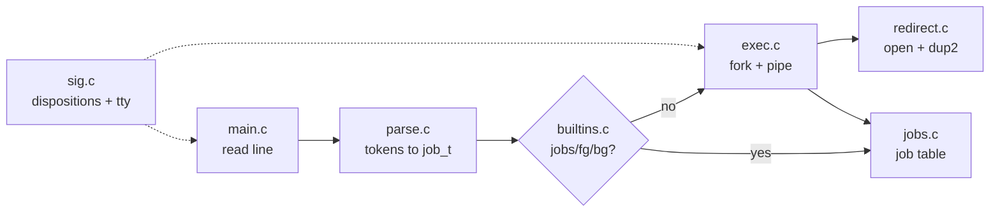

# How yash works

## Overview

The shell is a single loop that turns one line of text into processes. Each
stage is a separate module, and they communicate only through the `job_t` struct
defined in `yash/include/yash.h`.

```
line ─► parse ─► job_t ─► builtins? ─► exec ─► jobs (bookkeeping)
```



## The data model

Everything hinges on two structs.

A `cmd_t` is one program plus its redirections:

```c
char  *argv[];   /* NULL terminated, ready for execvp */
char  *infile;   /* target of <,  NULL if unused */
char  *outfile;  /* target of >,  NULL if unused */
char  *errfile;  /* target of 2>, NULL if unused */
pid_t  pid;
```

A `job_t` is everything typed on one line — one or two commands that share a
process group:

```c
int         jid;         /* the [n] shown by jobs */
pid_t       pgid;        /* shared by every command in the job */
job_state_t state;       /* RUNNING / STOPPED / DONE */
int         background;  /* line ended with & */
int         ncmds;       /* 1 or 2 */
int         nlive;       /* children not yet reaped */
cmd_t       cmds[2];
char        cmdline[];   /* original text, for jobs output */
char        buf[];       /* mutable copy, argv points into this */
```

Two buffers exist because tokenizing is destructive. `strtok_r` overwrites each
separator with `\0`, so `argv` entries are just pointers into `buf`. `cmdline`
keeps an untouched copy so `jobs` can print what you actually typed.

## main.c — the loop

```c
for (;;) {
    jobs_reap();                 /* print Done lines, free finished jobs */
    fputs("# ", stdout);         /* prompt, no newline */
    fflush(stdout);              /* so it appears before the blocking read */
    fgets(line, ...);            /* NULL means EOF or a signal */
    line[strcspn(line, "\n")] = '\0';
    parse_line(line, &job);
    builtin_try(&job) || exec_job(&job);
}
jobs_kill_all();
```

`fgets` returning `NULL` is ambiguous, so `feof` distinguishes a real Ctrl-d
(exit) from a read interrupted by a signal (clear the error, print a newline,
reprompt).

Reaping happens at the *top* of the loop, which is why `Done` lines appear right
after you press Enter rather than at some arbitrary moment.

## parse.c — text to structure

The assignment guarantees every operator is surrounded by spaces, so parsing is
a single left-to-right pass with no backtracking and no state machine.

1. `strtok_r` splits `buf` on spaces and tabs.
2. Each token is classified:
   - `<`, `>`, `2>` — consume the **next** token into the matching field
   - `|` — close the current command, switch to `cmds[1]`
   - `&` — set `background`
   - anything else — append to the current command's `argv`
3. Each `argv` is NULL-terminated and `ncmds` is set.

A line is rejected (`PARSE_ERROR`) when it breaks any rule: a redirection with
nothing to attach to, the same direction redirected twice, a missing redirection
target, a plain word appearing after a redirection, a second `|`, an `&` that
isn't last, or `|` and `&` on the same line. `main` silently ignores rejected
lines, which is exactly the required behavior for invalid input.

The trailing `&` is stripped from `cmdline` during parsing. That way job output
can append ` &` for *any* background job, including one moved there later by
`bg`, instead of only the ones typed with `&`.

## redirect.c — replacing the standard streams

File descriptors 0, 1 and 2 are just numbers. `dup2(fd, 1)` makes descriptor 1
refer to the same open file as `fd`, closing whatever 1 was. That is the whole
mechanism behind redirection.

```c
open(infile,  O_RDONLY)                            → dup2 onto 0
open(outfile, O_WRONLY|O_CREAT|O_TRUNC, 0664 bits) → dup2 onto 1
```

Two details matter:

- `O_CREAT` satisfies "create the file if it doesn't exist", and the permission
  bits `S_IRUSR|S_IWUSR|S_IRGRP|S_IWGRP|S_IROTH` keep the result readable.
- Opening the input with plain `O_RDONLY` already fails with `ENOENT` when the
  file is missing. No separate existence check is used — checking first would be
  a time-of-check/time-of-use race.

This runs **in the child, after fork**, so a failed redirection kills only that
command and never the shell.

## exec.c — creating processes

```c
pipe(fds);                     /* only when ncmds == 2 */
for each command:
    fork()
      child:  setpgid(0, pgid);
              sig_reset_child();
              dup2 the pipe end, close both fds;
              redirect_apply(cmd);
              execvp(argv[0], argv);
              _exit(127);
      parent: record pid; setpgid(pid, pgid);
close both pipe fds in the parent;
```

Points worth understanding:

- **Both the parent and the child call `setpgid`.** Whichever runs first wins,
  and the other is harmless. Doing it in only one place leaves a race where a
  signal could arrive before the group is set.
- **The pipe fds are closed in three places** — both children and the parent.
  A pipe reader sees EOF only after *every* copy of the write end is closed, so
  one forgotten `close` makes `wc` hang forever.
- **`redirect_apply` runs after the pipe `dup2`**, so an explicit `> file` on the
  left command overrides the pipe. That is why
  `cat a > out | cat < b` sends nothing through the pipe.
- **`execvp`**, not `execv`: the `p` performs the PATH search, and the
  environment is inherited automatically across `fork`/`exec`.
- **`_exit`, not `exit`**, in a failed child, so it can't flush stdio buffers the
  parent already owns and duplicate output.
- Nothing is printed when `execvp` fails; an unknown command is silently ignored.

Every job — foreground included — is added to the job table, because Ctrl-z can
turn a foreground job into a stopped one that `fg` must be able to find.

## sig.c — signals and terminal ownership

The entire Ctrl-c / Ctrl-z requirement reduces to one fact: **the terminal
delivers SIGINT and SIGTSTP to the foreground process group.** The shell never
forwards anything.

So the shell does two things:

1. **Makes those signals harmless to itself.** SIGINT and SIGTSTP get an empty
   handler; SIGTTIN and SIGTTOU are ignored so the shell's own `tcsetpgrp` can't
   stop it.
2. **Hands the terminal to the job.** `tcsetpgrp(0, job->pgid)` before waiting,
   and back to `shell_pgid` afterward.

An empty handler is used rather than `SIG_IGN` for SIGINT/SIGTSTP, installed
without `SA_RESTART`. That way Ctrl-c at the prompt interrupts `fgets` with
`EINTR` and the shell reprompts on a fresh line. `SIG_IGN` wouldn't interrupt
the read at all.

`sig_reset_child` restores `SIG_DFL` in every child before `exec`. Handlers are
reset automatically by `exec`, but `SIG_IGN` survives it, so without this a
child would inherit ignored signals and never die on Ctrl-c.

**SIGCHLD is deliberately left at its default.** Reaping is done by polling with
`WNOHANG` from the read loop instead, which puts `Done` messages exactly where
the spec wants them and avoids calling async-signal-unsafe `printf` inside a
handler.

## jobs.c — the job table

A singly linked list in creation order. The head is the oldest job, so the tail
always holds the highest `jid` — which makes the bash numbering rule
("new job gets 1 + highest current number") a single `tail->jid + 1`.

`jobs_add` copies the parsed job onto the heap, because the parser filled a
struct on `main`'s stack that is reused on the next iteration. The copy is not a
plain `memcpy`: every `argv`, `infile`, `outfile` and `errfile` pointer refers
into the *old* `buf`, so `rebase_pointers` rewrites each one as
`new_buf + (old_pointer - old_buf)`. Skipping this step leaves dangling pointers
that usually appear to work and then corrupt at the worst moment.

There are two waiting functions, and the distinction is the heart of job
control:

| | `jobs_wait_fg` | `jobs_reap` |
|---|---|---|
| Blocks? | yes | no (`WNOHANG`) |
| Waits on | `-pgid`, one job | `-1`, any child |
| Used for | foreground jobs, `fg` | background jobs, `Done` lines |

Both pass `WUNTRACED` so a stopped child is reported rather than silently
waited on; `jobs_reap` adds `WCONTINUED` to notice jobs resumed by `bg`.
`jobs_wait_fg` returns immediately on `WIFSTOPPED` — one member stopping means
the whole group stopped, since they share a pgid — and it retries on `EINTR`,
which is not a real failure.

`jobs_kill_all` runs at exit and sends `SIGKILL` to each group. SIGKILL cannot
be caught or ignored and reaches stopped processes without a preceding
`SIGCONT`, guaranteeing no child outlives the shell.

## builtins.c — jobs, fg, bg

These three must run inside the shell process. Forking them would mutate a copy
of the job table and then throw it away, so `builtin_try` is called *before*
`exec_job` and returns 1 when it handled the line.

- **`jobs`** walks the list oldest to newest, marking the current job `+` and
  every other job `-`.
- **`fg`** takes the most recent running-or-stopped job, prints its command
  line, gives it the terminal, sends `SIGCONT` if it was stopped, then blocks in
  `jobs_wait_fg`.
- **`bg`** takes the most recent *stopped* job only — a job already running in
  the background isn't a candidate — sends `SIGCONT`, marks it background, and
  prints its line in jobs format without waiting.

`kill(-pgid, SIGCONT)` uses a negative pid, which means "every process in this
group", so both halves of a pipeline resume together.

## Why the modules are split this way

Each file owns one failure mode, which makes bugs findable:

| Symptom | Look in |
|---|---|
| Wrong tokens, line ignored unexpectedly | `parse.c` |
| File not created, wrong permissions, missing input not failing | `redirect.c` |
| Pipeline hangs, command not found, wrong exit path | `exec.c` |
| Ctrl-c kills the shell, Ctrl-z does nothing | `sig.c` |
| Wrong job numbers, missing `Done`, zombies | `jobs.c` |
| `fg`/`bg` pick the wrong job | `builtins.c` |

Notably, every `waitpid` call lives in `jobs.c` and every signal disposition
lives in `sig.c`. Those two are where job-control bugs concentrate, so keeping
them in one place each means there is exactly one file to audit when something
misbehaves.
